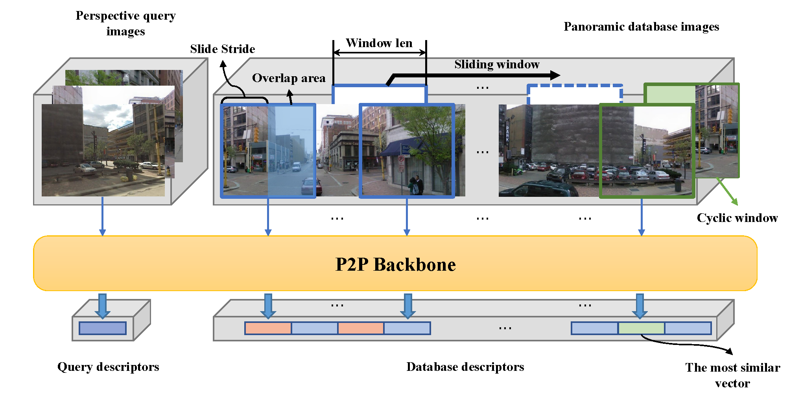
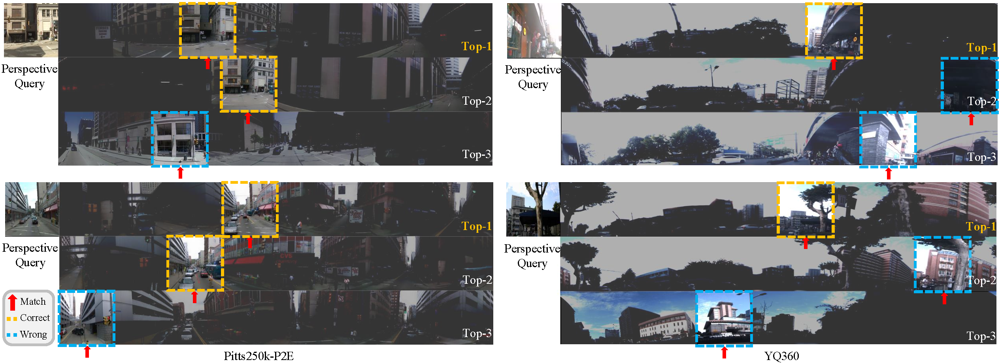

<div align="center"> 

## PanoVPR: Towards Unified Perspective-to-Equirectangular Visual Place Recognition via Sliding Windows across the Panoramic View

</div>

<p align="center">
  <a href="https://www.researchgate.net/profile/Ze-Shi-3" target="_blank">Ze&nbsp;Shi*</a> <b>&middot;</b>
  <a href="https://www.researchgate.net/profile/Shi-Hao-10" target="_blank">Hao&nbsp;Shi*</a> <b>&middot;</b>
  <a href="https://www.researchgate.net/profile/Kailun-Yang" target="_blank">Kailun&nbsp;Yang</a> <b>&middot;</b>
  Zhe&nbsp;Yin</a> <b>&middot;</b>
  Yining&nbsp;Lin</a> <b>&middot;</b>
  <a href="https://www.researchgate.net/profile/Kaiwei-Wang-4" target="_blank">Kaiwei&nbsp;Wang
  <br> <br>
</p>

<p align="center">
    <a href="https://arxiv.org/pdf/2303.14095.pdf">
        </a>
    <a href="https://pytorch.org/">
        </a>
    <a href="https://paperswithcode.com/task/visual-place-recognition">
        </a>
    <a href="https://github.com/zafirshi/PanoVPR/blob/master/LICENSE">
        </a>
</p>

## Update

- [2023-11] :gear: Code Release
- [2023-08] :tada: PanoVPR is accepted to 26th IEEE International Conference on Intelligent Transportation Systems ([ITSC-2023](https://2023.ieee-itsc.org/)).
- [2023-03] :construction: Init repo and release [arxiv](https://arxiv.org/pdf/2303.14095.pdf) version

## Introduction

We propose a **V**isual **P**lace **R**ecognition framework for retrieving **Pano**ramic database images using perspective query images, dubbed **PanoVPR**. To achieve this, we adopt sliding window approach on panoramic database images to narrow the model's observation range of the large field of view panoramas. We achieve promising results in a derived dataset *Pitts250K-P2E* and a real-world scenario dataset *YQ360*. 

For more details, please check our [arXiv](https://arxiv.org/pdf/2303.14095.pdf) paper.

## Sliding window strategy



## Qualitative results



## Usage

### Dataset Preparation

Before starting, you need to download the Pitts250K-P2E dataset and the YQ360 dataset [[OneDrive Link](https://zjueducn-my.sharepoint.com/:f:/g/personal/zafirshi_zju_edu_cn/IgAuDf_6LTa1QI8ZLtFJ0_qUAXbDkhdz7wBIvGfcBruwI9M?e=Q2tGI5)][[BaiduYun Link](https://pan.baidu.com/s/1IBcpAwnwY5YlqfgfSqRz-w?pwd=Pano)].

If the link is out of date, please email _office_makeit@163.com_ for the latest available link!

Afterwards, specify the `--datasets_folder` parameter in the `parser.py` file.


### Setup

You need to first create an environment from file `environment.yml` using [Conda](https://docs.conda.io/projects/miniconda/en/latest/miniconda-install.html), and then activate it.

```bash
conda env create -f environment.yml --prefix /path/to/env
conda activate PanoVPR
```

### Train

If you want to train the network, you can change the training configuration and the dataset used 
by specifying parameters such as `--backbone`, `--split_nums`, and `--dataset_name` in the command line.

Meanwhile, adjust other parameters according to the actual situation.
By default, the output results are stored in the `./logs/{save_dir}` folder.

**Please note that the `--title` parameter must be specified in the command line.** 

```bash
# Train on Pitts250K-P2E
python train.py --title  swinTx24 \
                --save_dir clean_branch_test \ 
                --backbone swin_tiny \
                --split_nums 24 \
                --dataset_name pitts250k \ 
                --cache_refresh_rate 125 \
                --neg_sample 100 \
                --queries_per_epoch 2000
```

### Inference

For the inference process, you need to specify the absolute path where the `best_model.pth` is stored in the `--resume` parameter.

```bash
# Val and Test On Pitts250K-P2E
python test.py --title  test_swinTx24 \
                --save_dir clean_branch_test \ 
                --backbone swin_tiny \
                --split_nums 24  \
                --dataset_name pitts250k \
                --cache_refresh_rate 125 \
                --neg_sample 100 \
                --queries_per_epoch 2000 \
                --resume <absoulate path containing best_model.pth>
```

## Acknowledgments

We thank the authors of the following repositories for their open source code:

- [tranleanh/image-panorama-stitching](https://github.com/tranleanh/image-panorama-stitching)
- [gmberton/datasets_vg](https://github.com/gmberton/datasets_vg)
- [gmberton/deep-visual-geo-localization-benchmark](https://github.com/gmberton/deep-visual-geo-localization-benchmark)


## Cite Our Work

Thanks for using our work. You can cite it as:

```bib
@INPROCEEDINGS{shi2023panovpr,
  author={Shi, Ze and Shi, Hao and Yang, Kailun and Yin, Zhe and Lin, Yining and Wang, Kaiwei},
  booktitle={2023 IEEE 26th International Conference on Intelligent Transportation Systems (ITSC)}, 
  title={PanoVpr: Towards Unified Perspective-to-Equirectangular Visual Place Recognition via Sliding Windows Across the Panoramic View}, 
  year={2023},
  pages={1333-1340},
  doi={10.1109/ITSC57777.2023.10421857}
}
```
